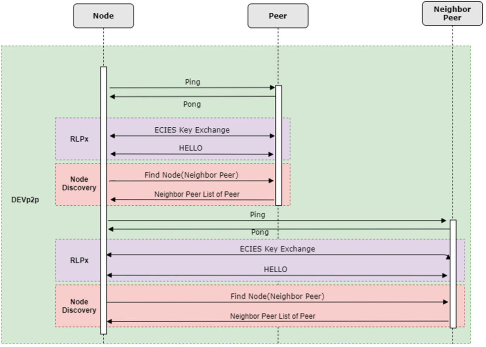

# Sistem Voting Elektronik Berbasis Ethereum Smart Contract

## Ketahanan Terhadap Social Engineering

*Pak Bayu*

Sistem berbasis blockchain tidak tahan terhadap serangan yang bersifat social engineering karena blockchain khususnya ethereum hanya menjaga data yang sudah tersimpan tidak bisa dimanipulasi lagi. Jadi jika pemilik private key telah dimanipulasi secara social engineering untuk melakukan sebuah transaksi maka blockchain akan tetap mengganggap transaksi tersebut valid.

## Kenapa UDP daripada TCP

*Pak Bayu*

Maaf sebelumnya pada ujian proposal terdapat kesalahan, jadi protokol udp hanya digunakan untuk discovery protocol. Untuk pertukaran informasi tetap menggunakan protokol TCP
Protokol UDP digunakan oleh Ethereum sebagai discovery protocol. Discovery protocol adalah mekanisme kademlia yang digunakan oleh Ethereum untuk mendapatkan alamat IP node yang sedang online. Kademlia adalah adalah desain jaringan peer-to-peer berupa DHT (Distributed Hash Table) yang menyimpan infomasi alamat node yang terhubung dengan node lainnya sehingga node di dalam jaringan bisa melakukan lookup secara berkala.

Sedangkan untuk pertukaran data block, Ethereum menggunakan protocol RLPx yang menggunakan protokol TCP. Protokol ini mewajibkan setiap node yang akan melakukan pertukaran data untuk melakukan serangkaian proses enkripsi

Seperti yang terlihat pada gambar, hal pertama yang dilakukan adalah mengirim pesan ping ke sebuah node. Jika dibalas dengan pong maka akan dilanjutkan ke proses pertukaran kunci ECIES. Jika tidak dibalas maka alamat node tersebut akan dihapus dari DHT.

## Kenapa Memilih Ethereum dari segi keamanan

*Pak Suar*

Karena spesifikasi teknologi Ethereum dibuat secara opensource sehingga selain Ethereum Foundation, komunitas pun dapat terlibat dalam pengembangan dan penyempurnaan teknologi ethereum. Hal seperti ini memberikan keuntungan ketika terjadi kesalahan yang fatal dalam jaringan ethereum, banyak orang yang bisa terlibat dalam perbaikan kesalahan tersebut.

- contoh dagor dagorath, eth split menjadi eth dan etc

