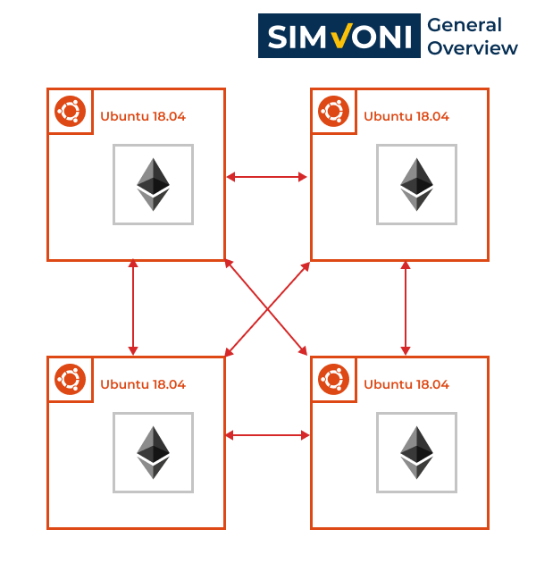

# Sistem Voting Elektronik Berbasis Ethereum Smart Contract

## Ketahanan Terhadap Social Engineering

*Pak Bayu*

Sistem berbasis blockchain tidak tahan terhadap serangan yang bersifat social engineering karena blockchain khususnya ethereum hanya menjaga data yang sudah tersimpan supaya tidak bisa dimanipulasi lagi. Jadi jika pemilik private key telah dimanipulasi secara social engineering untuk melakukan sebuah transaksi maka blockchain akan tetap mengganggap transaksi tersebut valid.

## Kenapa UDP daripada TCP

*Pak Bayu*

## Bagaimana proses sinkronisasi antar node

*Pak Suar*

Maaf sebelumnya pada ujian proposal terdapat kesalahan, jadi protokol udp hanya digunakan untuk discovery protocol. Untuk pertukaran informasi tetap menggunakan protokol TCP.
Protokol UDP digunakan oleh Ethereum sebagai discovery protocol. Discovery protocol adalah mekanisme kademlia yang digunakan oleh Ethereum untuk mendapatkan alamat IP node yang sedang online. Kademlia adalah adalah desain jaringan peer-to-peer berupa DHT (Distributed Hash Table) yang menyimpan infomasi alamat node yang terhubung dengan node lainnya sehingga node di dalam jaringan bisa melakukan lookup secara berkala.

Sedangkan untuk pertukaran data block, Ethereum menggunakan protocol RLPx yang menggunakan protokol TCP. Protokol ini mewajibkan setiap node yang akan melakukan pertukaran data untuk melakukan serangkaian proses enkripsi

Seperti yang terlihat pada gambar, hal pertama yang dilakukan adalah mengirim pesan ping ke sebuah node. Jika dibalas dengan pong maka akan dilanjutkan ke proses pertukaran kunci ECIES. Jika tidak dibalas maka alamat node tersebut akan dihapus dari DHT. Dalam jaringan Ethereum setiap request dan response memiliki timeout sebesar 500ms dan operasi untuk protokol RLPx memiliki timeout sebesar 5 detik. DHT akan diupdate secara berkala setiap 30 detik.

## Topologi Jaringan 

*Pak Suar*

Karena proses sinkronisasi node Ethereum menggunakan DHT, maka topologi jaringan Ethereum adalah seperti gambar tersebut. Setiap node akan berusaha terhubung ke peer node yang ada dalam sebuah jaringan sesuai dengan kemampuan maksimal dari node tersebut. Contohnya peer maksimal dari openethereum adalah 25 peer

## Kenapa Memilih Ethereum dari segi keamanan

*Pak Suar*

Karena Ethereum adalah platform blockchain pertama yang memberikan kemampuan untuk melakukan eksekusi program komputer pada blockchain. Sehingga ekosistem pengembangan Ethereum dan aplikasi berbasis Ethereum sudah sangat mature. Selain itu Ethereum Foundation selaku maintainer project Ethereum juga sangat aktif dalam memberikan update-update keamanan untuk node Ethereum.

## Bagian yang "smart" dari smart contract

*Pak Suar*

Istilah "smart contract" diperkenalkan oleh Nick Szabo pada tahun 1996. Kontrak adalah sebuah kumpulan pernyataan yang disetujui dalam rangka "pertemuan pikiran" dalam sebuah hubungan misalnya hubungan bisnis. Kontrak tradisional seperti ini tidak bisa dilakukan secara langsung oleh kedua belah pihak karena diperlukan pihak ketiga seperti notaris dan beberapa saksi untuk memastikan keabsahan kontrak. Karena membuat kontrak tradisional memerlukan biaya yang besar, waktu yang lama serta proses digitalisasi mulai berkembang pesat maka terciptalah istilah "smart contract". Definisi "smart contract" menurut Nick Szabo adalah kumpulan pernyataan yang disetujui dalam bentuk digital dalam sebuah protokol dimana pihak yang bersangkutan juga harus terlibat didalam protokol tersebut. Definisi tersebut sesuai dengan pengertian program komputer yang berjalan pada Ethereum dimana pihak yang akan melakukan kontrak harus tergabung dalam jaringan Ethereum dan pernyataan yang disetujui dicantumkan di dalam program komputer. Maka dari itu program komputer yang berjalan pada Ethereum disebut Smart Contract.

## Kompatibilas Mobile

*Pak Suar*

## Proses daftar dan siapa yang melakukan validasi

*Pak Suar*

Karena yang menjadi concern sebelumnya adalah voter yang memilih kandidat melalui perangkat mobile, sehingga yang mendukung tampilan mobile adalah tampilan voter. Untuk pendaftaran menjadi election authority juga diawali dengan membuat akun voter maka demo nya menjadi satu.

1. Daftar voter
2. Tunjukkan tampilan upgrade role
3. Request upgrade role
4. Approve super admin
5. Login kembali
6. Akun sudah menjadi election authority